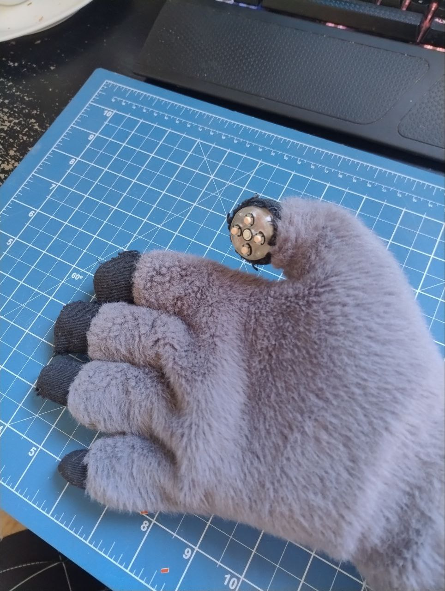
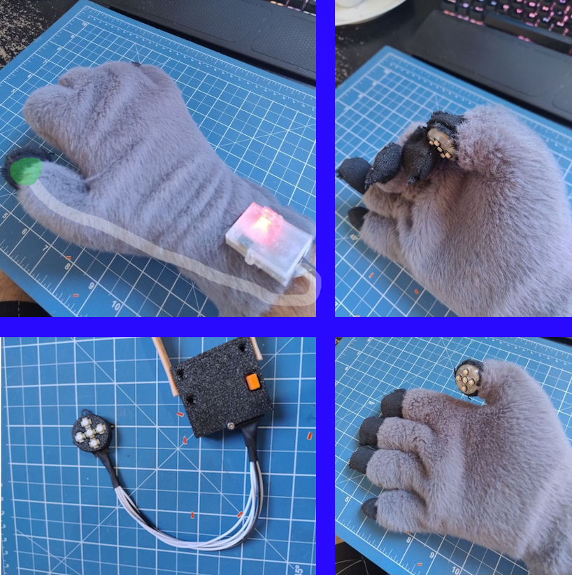
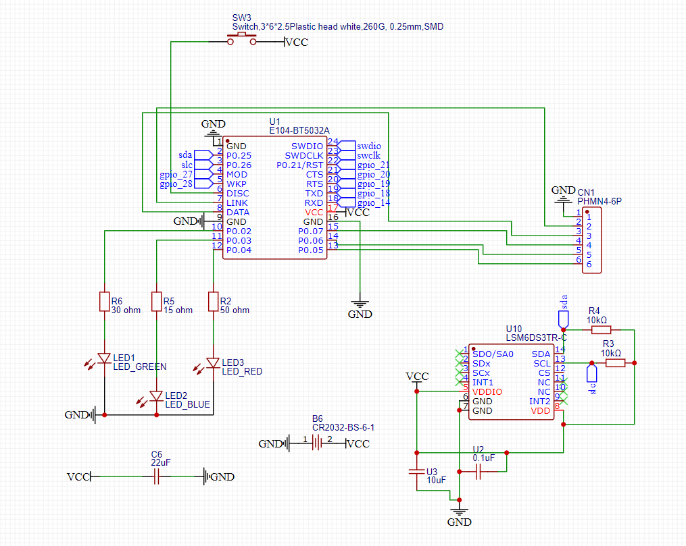
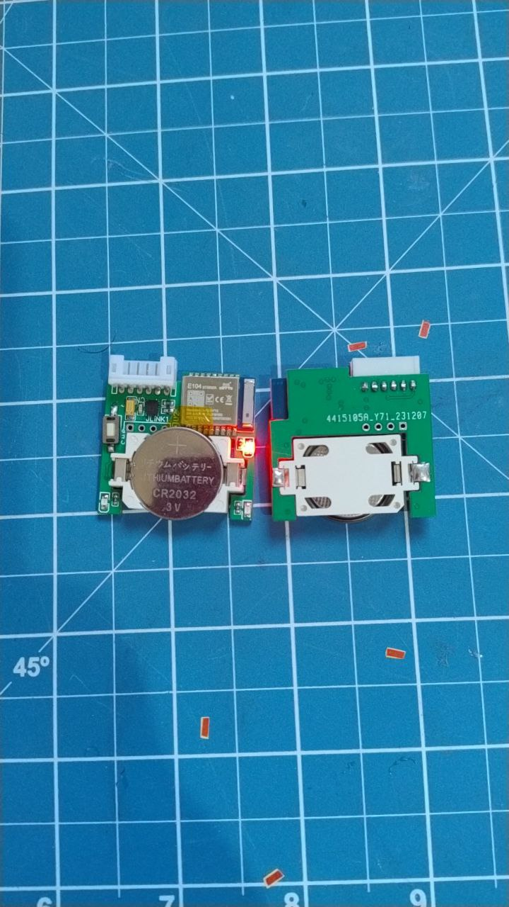
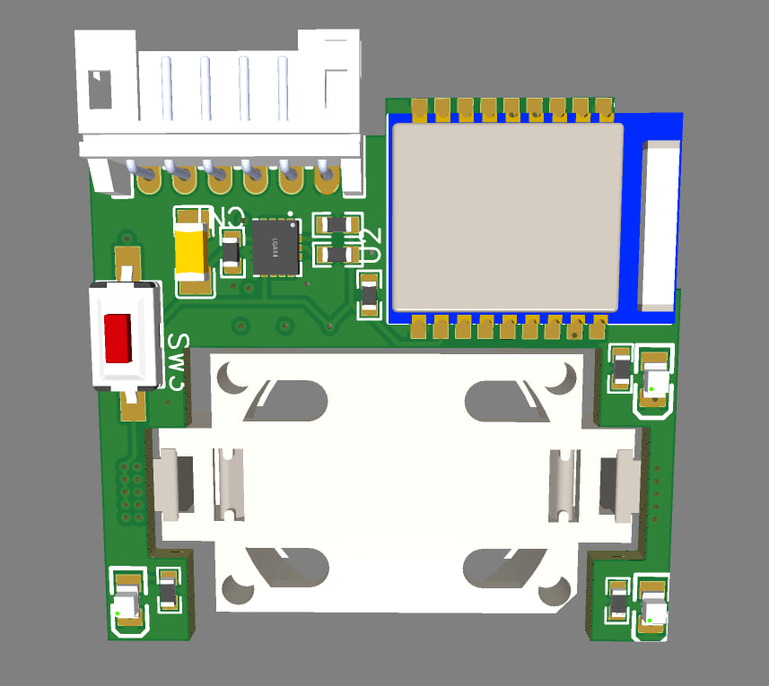

# Remote controller for fursuit paws

I made this device to help remote control electronic stuff in fursuit/protogens.

Been using it for some time, iterated and ended upon this version that is compact, yet can do alot!

# Features

* Based on the low powerr NRF52832 IC
* Has an low power gyroscope/accelerometer LSM6DS3
* Its small! 6.4mm x 30 x 34mm
* Low power. Been using the same cr2032 for two years... But my guess it might last just one year.
* Designed to be integrated to a fursuit paw!
* 20 updates per second while transmitting.

# Integrating in your paws

It can be wore like a watch under or over the paw.
The wires go trough the polegar finger and trough a pinch movement you can select intuitively and easily which button to press!

# Schematic

# PCB

# Materials

* The pcb itself
* An E-byte module E104-BT5032A ([Link](https://aliexpress.com/item/4000538644215.html))
* An j-link programmer or clone ([Link](https://pt.aliexpress.com/item/1005006734954628.html))
* A few components:

| Name          | Quantity | Footprint                 | LCSC part |
|---------------|----------|---------------------------|-----------|
| LSM6DS3TR-C   | 1        | LGA-14_L3.0-W2.5-P0.50-TL | C967633   |
| 10uF          | 1        | 0603                      |           |
| 0.1uF         | 1        | 0603                      |           |
| 30 ohm        | 3        | 0603                      |           |
| Push button   | 1        | SW-SMD_L6.1-W3.6-LS8.0    | C71857    |
| CR2032-BS-6-1 | 1        | BAT-TH_CR2032-BS-6-1      | C70377    |
| PHMN4-6P      | 1        | PHMN4                     |           |
| Led           | 3        | 0603                      |           |

# The code

Here i have to say sorry. I bearly managed to get the code working using the messy NRF52 SDK.
I have plans to switch ASAP to [platformio and arduino interface](https://docs.platformio.org/en/latest/platforms/nordicnrf52.html).

